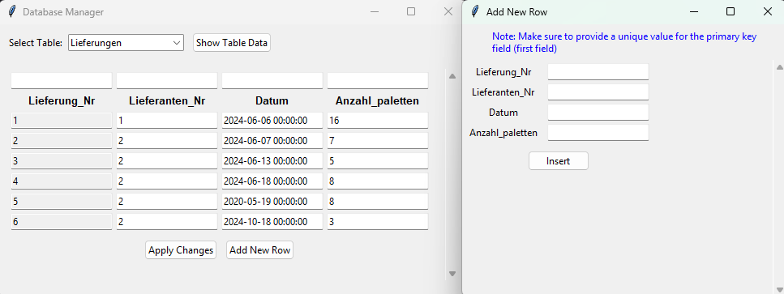

# Access Database Manager
## Overview
Access Database Manager is a specialized tool designed to provide direct access to Microsoft Access databases without requiring Microsoft Access installation. This lightweight application enables users to view, modify, and manage database content through a simple and intuitive graphical interface.

## Prerequisites
- Windows Operating System
- Python 3.10 (will be prompted to install if not found)

## Installation
### Step 1: Download Files
Download the following files:
- `AccessDatabaseManagerInstaller.exe`
- `loader.exe`
- `gui.exe`

### Step 2: Prepare Installation
Ensure all three files are in the same directory.

### Step 3: Install
Double-click `AccessDatabaseManagerInstaller.exe` to begin the installation process.

### Step 4: Run the Application
After installation, you can launch the application from:
- Desktop shortcut
- Start Menu
- `loader.exe` in the installation directory

## Features
- **Table Selection:** Easy access to different database tables
- **Data Viewing:** Clear grid-based display of table contents
- **Data Modification:** Direct editing of existing entries
- **New Record Creation:** Simple form for adding rows
- **Search Functionality:** Filter entries using column-specific search fields

## Example Interface

### Viewing Data
- The main interface displays table data in a grid format
- Each column represents a database field
- Each row represents a record

### Adding New Records
1. Click "Add New Row" button
2. Fill in the required information
3. Ensure unique primary key value
4. Click "Insert"

### Modifying Existing Data
1. Click directly in the cell to modify
2. Enter new value
3. Click "Apply Changes"

## Important Notes
- Primary key fields cannot be modified for existing records
- Ensure primary key values are unique when adding records
- Changes are saved directly to the database

## Troubleshooting
- Ensure Python 3.10 is installed
- Check that all required files are in the same directory
- Verify database file permissions

## Contact

